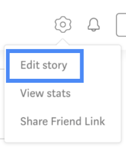
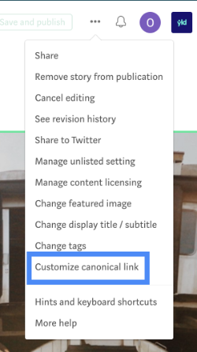
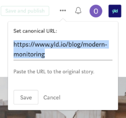

# Blog Documentation for Marketing

This walkthrough is for the marketing team, for a more technical explanation see [here](./blog).

The automated blog workflow has been designed to maintain the same workflow as any usual medium publication however we’ve added two small (but important) steps.

Standard Workflow:

- Author writes blog post and submits it for review to the YLD medium publication.
- Marketing will proof read and request any peer reviews required for the topic.
- Once the post has been approved, YLD publishes the blog normally.

New additional steps. (Nothing will break if these steps are not performed but it's a good idea to do them!)

- Update the canonical link.
- (Optional) Add preview image.

## To update the canonical link

**N.B. The new blog post will be live ~15-30mins after publishing depending on how long it takes for the task to be triggered**

- Go to the new blog post, at the top right there is a settings/cog icon, click here and then click `Edit story`.

  

- Once you’re in editing mode click the three dots on the top right to open the dropdown. At the bottom of the dropdown list you’ll want to click `Customize canonical link`.

  

- Add the new blog post link from the yld.io site, hit save and you’re good to go!

  

## Add preivew image

This step is only required if the blog published on medium has no images. Having images in blog posts is not critical to the new content but it is advised that you encourage authors to add some! If adding imagery is not possible then these are the steps to follow to include the image preview.

- Have the image you want to include saved to your computer. 1:1 ratio is preferred.
- Go to Contentful and find the blog post you want to change.
- In the blog post find the `Header Image` field.
- Add the new header image.
- Click publish and you're done!

### Why?

- The header image of a post is the image used when shared on social media.
- When scrolling through `/blog`, posts without images will just have a blank space where the image is meant to be. This isn't breaking anything but could look a lot better!

## FAQ

Q: If I change content on medium will it update on yld.io?
A: No, we only look for new urls in the RSS content and compare it to blog posts already published it on the CMS.

Q: How do I change content on a blog post then? Do I have to update it twice?
A: Yes, for this reason we encourage authors and proof readers to make sure everything is 100% ready before publishing but it can be easy to miss things sometimes! To change blog post content on CMS you'll need to write it in [markdown](https://github.com/adam-p/markdown-here/wiki/Markdown-Cheatsheet). Try not to change too much!
N.B. If you want to change a lot of content in a post it is probably better to delete the post from the CMS then retrigger the export script. You'll need engineering resource for this, [a guide](./blog)
